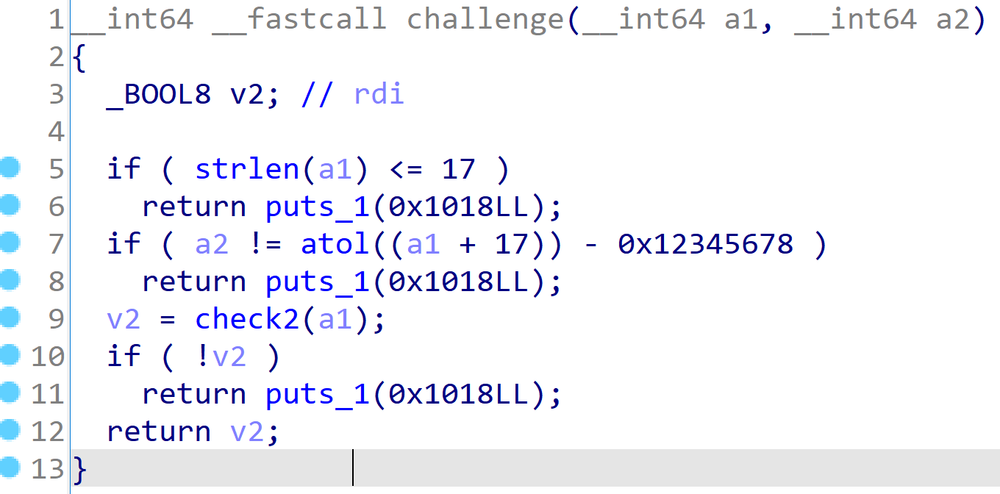
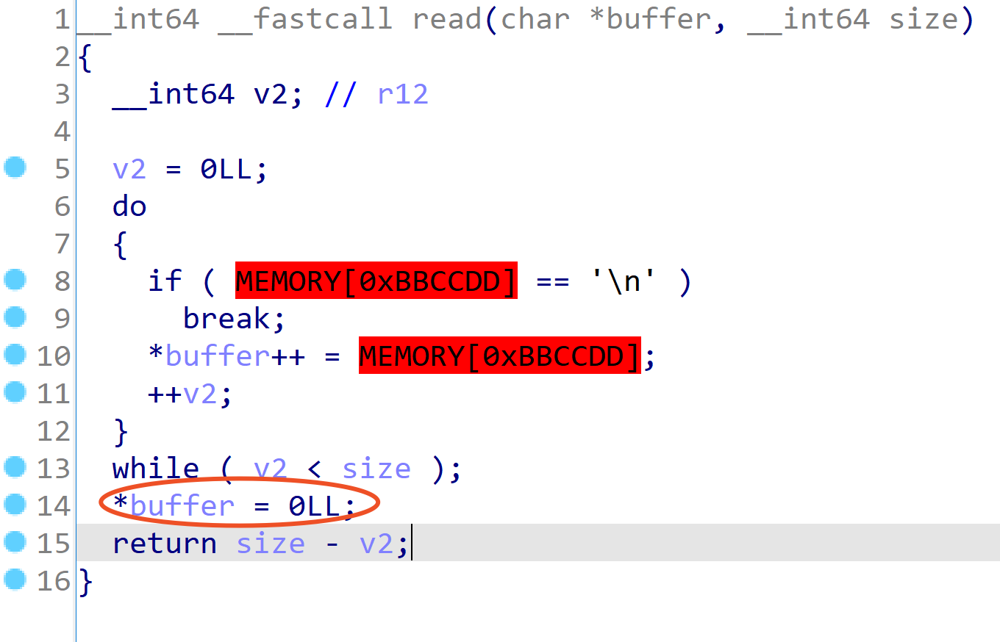
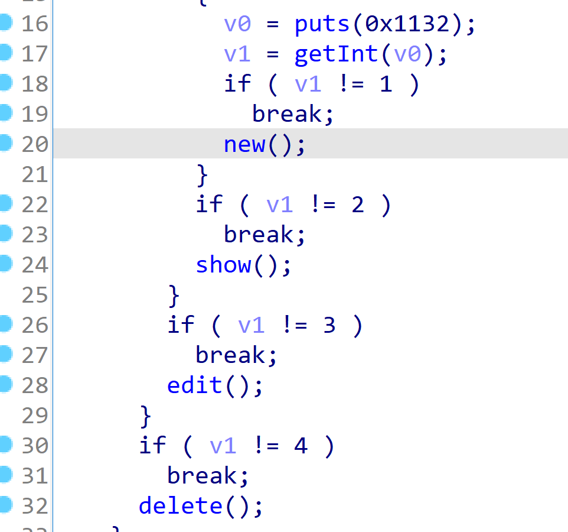
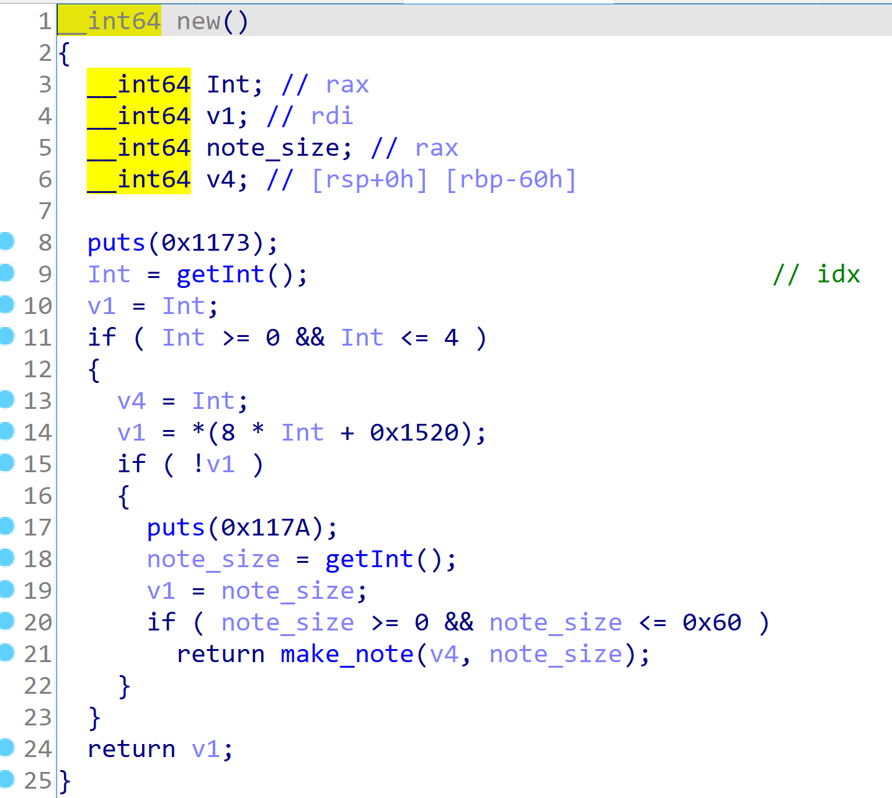

# QWB S5 vmnote recompiler
一个将 vmnote 指令集重编译成 x64 指令集的脚本，并且可以用 IDA 进行分析。

执行: python3 recompiler.py
输入文件: note.bin
输出文件: re2.bin

re2.bin 是对 vm 指令重编译的 bin 文件

vm 特殊指令编译对照表:

| opcode   | 伪代码      | 替代指令             |
| -------- | ----------- | -------------------- |
| 0x3      | getchar reg | mov reg, [0xbbccdd]  |
| 0x17 / 0 | putchar reg | mov [r11+0xaa], reg  |
| 0x17 / 1 | putInt reg  | mov [r11+0xaa2], reg |

**调用约定处理**

将作为函数参数的寄存器用对应的 GNU x64 调用约定指定的寄存器替换。

按照调用约定替换寄存器后，vm 中函数用 rdi 做返回值，可以将 rdi 的值通过 mov 指令传递给 rax 以便于 ida 分析

```
func:
_0x21: leave
_0x22: mov rax, rdi
ret

_0x23: call func
mov rdi, rax

```

**mul 指令处理**

vm 中的 mul 指令支持两个操作数，这在x64中是不允许的，做一个简单的转化即可

```python
def gen_mul(self, op1, op2):
    code = """
        mov rax, %s
        mov rbx, %s
        mul rbx
        mov %s, rax
        """ % (op1, op2, op1)
    return code
```

## IDA 分析 re2.bin

代码入口函数地址 0x200

数据段地址 0x0

IDA 需要指定 64位模式，并将编译器改为 `GNU C++`

修改编译器的方法: 菜单 ->【options】-> 【Compiler】将第一个 Complier 改为 GNU C++


## 效果



off by null



menu



new note




